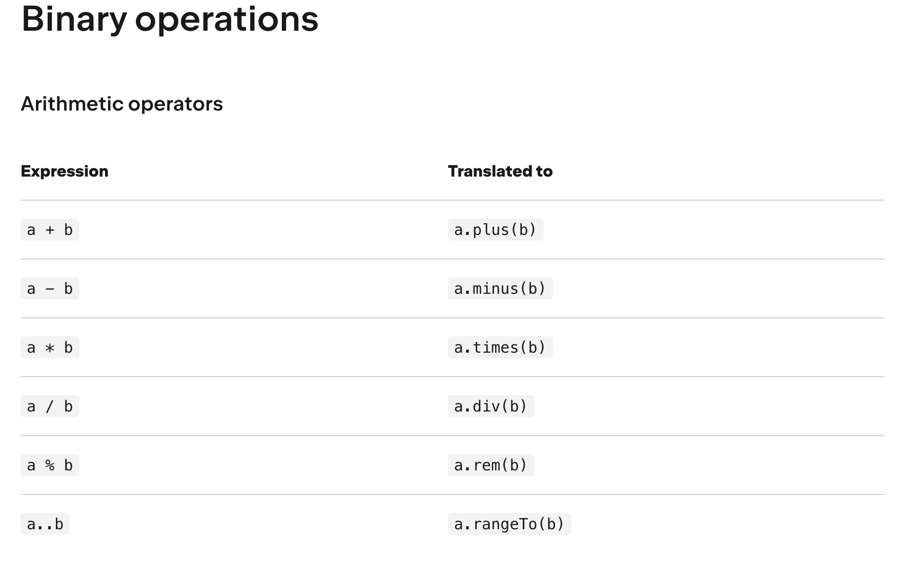

# 연산자

단항, 산술, 비교 연산자는 동일하다.

단, Kotlin에서는 비교 연산자를 객체끼리 사용할 때 자동으로 `compareTo()` 함수를 활용한다.

## 동등성과 동일성

Java에서는 동등성 equals(), 동일성 == 를 사용해서 주소를 비교했다.

Kotlin에서는 자바스크립트처럼 동등성 비교는 == 동일성 비교는 ===를 사용한다.

---
Kotlin도 java처럼 Lazy 연산을 수행한다.

- in / !in
  - 컬렉션이나 범위에 포함되어 있다, 있지않다.
- a..b
  - a부터 b까지의 범위 객체 생성
- a[i]
  - a에서 특정 index로 문자값을 가져온다.

## 연산자 오버로딩

kotlin에서는 객체마다 연산자를 직접 정의할 수 있다.

